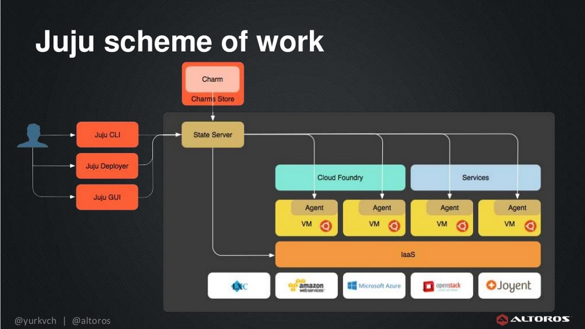
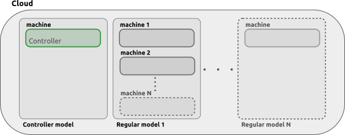

# Juju

Developing an application for the cloud is accomplished by relying on the Infrastructure as a Service (IaaS) or the Platform as a Service(PaaS). 
Juju is an open source application modeling tool. It allows you to deploy, configure, scale and operate your software on public clouds like  Amazon AWS, Google GCE, and Microsoft Azure as well as private Openstack based clouds.  Deep Server provisioning is provided by
Juju using MAAS, Metal as a Service. We are exploring the deployment model of Juju.

## Introduction
Deploying [software component systems][lascu2015automatic] is
becoming a critical challenge, especially due to the advent of Cloud
Computing technologies that make it possible to quickly run complex
distributed software systems on-demand on a virtualized infrastructure
at a fraction of the cost compared to a few years ago. When the number
of software components needed to run the application grows, and their
interdependencies become too complex to be manually managed, it is
important for the system administrator to use high-level languages for
specifying the expected minimal system.

## IaaS, PaaS and MaaS

The IaaS provides a set of low-level resources forming a bare
computing environment. Developers pack the whole software stack into
virtual machines containing the application and its dependencies and
run them on physical machines of the provider's cloud. Exploiting the
IaaS directly allows a great flexibility but requires also a great
expertise and knowledge of the cloud and application entities involved
in the process IaaS describes the provision of processing, storage and
networking (and potentially) other basic computing resources, over a
network and in an on-demand fashion. An example of IaaS is the
[AWS][www-aws], Juju.

IaaS customers does not host or manage the dedicated or virtual
server.
{#fig:juju-scheme-of-work-yurkevich}


In PaaS (e.g., [Google App Engine][www-googleappengine], [Azure][www-azure]
a full development environment is provided. Applications are directly written in a programming language
supported by the framework offered by the provider, and then
automatically deployed to the cloud. The high-level of automation
comes however at the price of flexibility: the choice of the
programming language to use is restricted to the ones supported by the
PaaS provider, and the application code must conform to specific APIs.


## Juju

In the IaaS, two [deployment approaches][lascu2015automatic] are
gaining more and more momentum: the holistic and the DevOps one.  In
the former, also known as model-driven approach, one derives a
complete model for the entire application and the deployment plan is
then derived in a top-down manner. In the latter, put forward by the
[DevOps community][www-devOps], an application is deployed by
assembling available components that serve as the basic building
blocks. This emerging approach works in a bottom-up direction: from
individual component descriptions and recipes for installing them, an
application is built as a composition of these recipes.


One of the representative for the DevOps approach is [Juju]
[www-juju], by Canonical. It is based on the concept of charm:
the atomic unit containing a description of a component.


In 2.5, Juju follows a Controller-Model type of configuration. A Controller
is the initial cloud instance, created in order to gain access to the Cloud.
It acts as the central management node for chosen cloud 

A Model is associated with a single controller. Applications units are 
contained within models and are installed via charms.

{#fig:juju-models}. 

Since a controller can host multiple models, the destruction of a
controller must be done with ample consideration since all its models
will be destroyed along with it.


## Juju Installation

Installing Juju is straight forward, it is described in detail in
[Getting Started document][www-jujucharm-documentation] and Paper
regarding deploying Juju on [MaaS][juju-paper].


The command to install Juju is 

```
$ sudo snap install juju --classic
```

For Ubuntu version lower than 16.04, snapd can be installed by

```
$ sudo apt install snapd
```

Not covering setup of LXD or MaaS for the physical containers or
cluster on which Juju is to be installed. We can refer to 
[][www-jujucharm-documentation] for LXD and [][juju-paper] for
MaaS installation.


## Adding and Managing Clouds

## Adding Credentials

## Controller Management

## Models

## Deploying Applications (Charms)

## Managing relations between Applications

## Cleaning up the Juju setup
